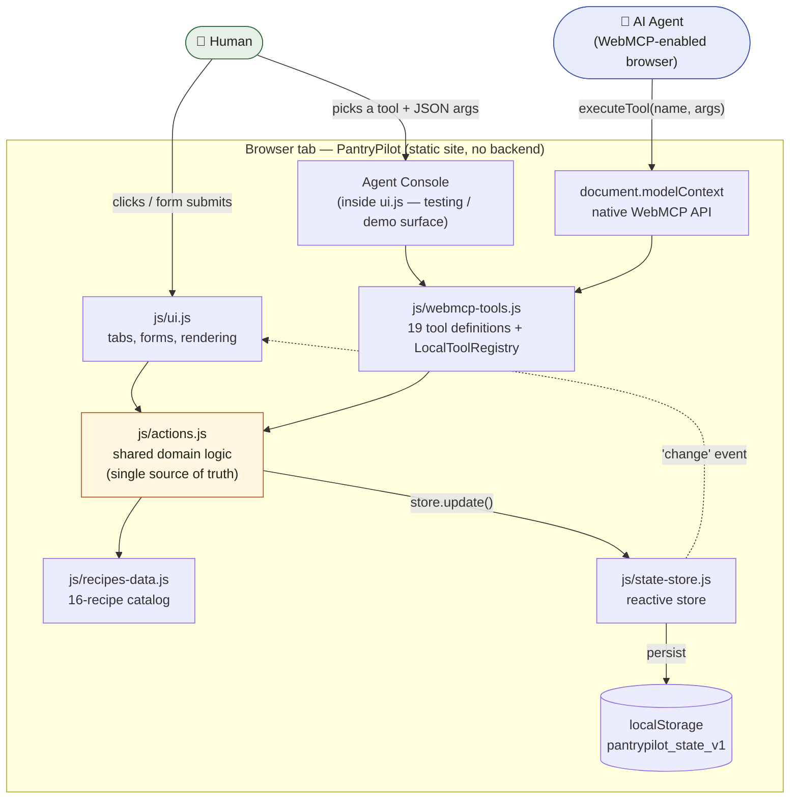
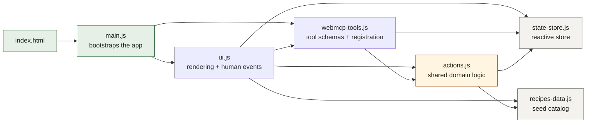
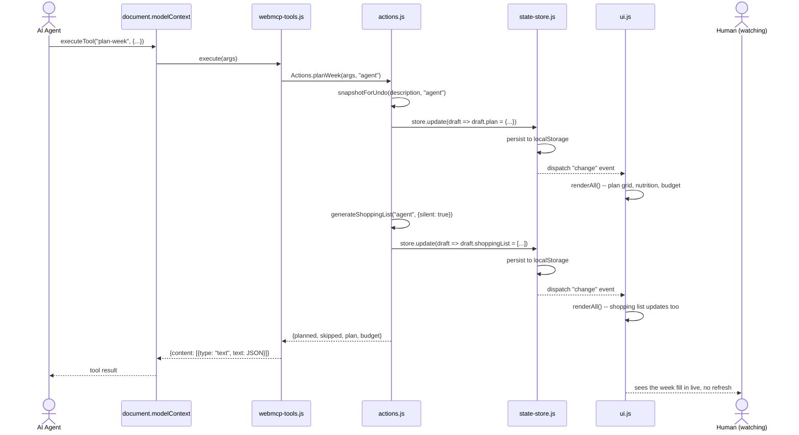

# Architecture

Three diagrams, source-of-truth `.mmd` files in this folder
([`system-architecture.mmd`](diagrams/system-architecture.mmd),
[`module-dependencies.mmd`](diagrams/module-dependencies.mmd),
[`tool-call-sequence.mmd`](diagrams/tool-call-sequence.mmd)), embedded below
so they render inline on GitHub. Each was validated with the Mermaid parser
before committing.

## System architecture

Two ways to drive the page — a human clicking the UI, or an agent calling
WebMCP tools — and both funnel through the same domain logic in
`js/actions.js`, so neither has capabilities the other lacks. The Agent
Console is a third entry point reachable from the UI: it calls the exact
same tool handlers (`LocalToolRegistry`) that `document.modelContext`
registers, which is how every tool was tested and demoed without a native
WebMCP browser available in the build environment.

## Module dependencies

The actual `import` graph. `actions.js` is the only module both the UI and
the WebMCP tool layer depend on — `state-store.js` and `recipes-data.js`
are leaves with no dependencies of their own.

## A tool call end to end

`plan-week` is the clearest example because it shows why undo snapshots
inside each action, immediately before its actual mutation, rather than at
the tool boundary: a single call cascades into two `store.update()` calls
(the plan itself, then the shopping-list regen it triggers as a side
effect), and both need to collapse into one undo step.

